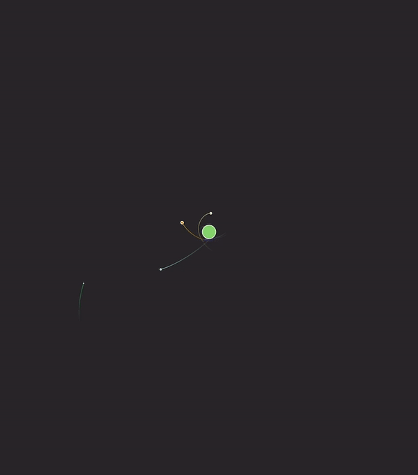

# fgmmr

Gravity in SpriteKit is a _single planet_ sort of gravity. By that I mean that it applies a single force to all bodies in the simulation - basically everything falls down. But what if you wanted a _mutliple planet_ sort of gravity, can that be achieved in SpriteKit?

The answer is yes, and it turns out it's it doesn't take a whole lot of code to get some fun and quite realistic results.

In this SpriteKit app, tapping on the screen creates a new 'planet'.

## How it Works

First we turn off gravity as it normally applies in a SpriteKit scene and then on every tick we apply Newton's law of universal gravitation to all the nodes in the physics simulation.

That is for every pair of nodes, apply a force to each one that is equal to the product of their masses (and the universal gravitational constant), divided by the distance between them, squared.

There are some tweaks to the above formula to make the numbers a bit easier to deal with (i.e. smaller) and to make creating stable systems a bit easier, but sticking exactly to the formula above and plugging in some realistic numbers things work pretty much as you'd expect.

In addition to simulating gravity, I'm also combining planets that pass close to each other and adding trails to trace their paths and giving new planets random colour. It all results in a surprisingly fun and addictive little toy so even if you're not interested in the code just build and run it on your iPhone (or watch, or Mac) and enjoy!
